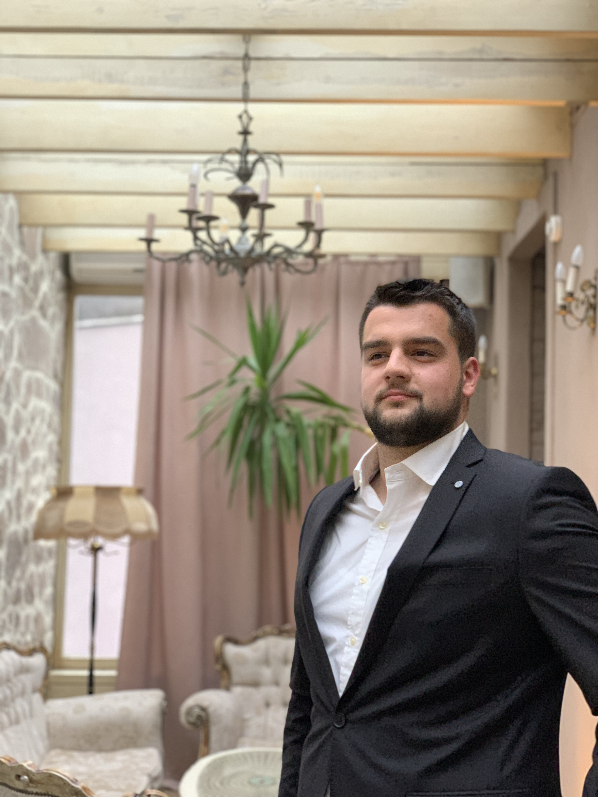

<html>
<head>
<title> Haris Godinjak - resume </title>
</head>

<body>
<h2> Haris Godinjak </h2>

<h3> Bio </h3>

 My name is Haris Godinjak. I was born in Sarajevo, Bosnia & Herzegowina. I am studing Computer Science at International University Sarajevo. 
I am interested in computer science and car industry. I love to play sports in my free time and I belive it is the best way to run away from everyday problems. 
I speak four languages: Bosnian, English, German and Turkish. 

<h3> Education </h3>
<table border = 5 width = 800 >

<tr>
<th> Year </th>
<th> Organisation </th>
<th> Education Level </th>
</tr>

<tr>
<th> 2005 - 2014 </th>
<th> "Prva osnovna škola" Ilidža </th>
<th> Primary school </th>
</tr>

<tr>
<th> 2014 - 2018 </th>
<th> "Prva bošnjačka gimnazija" Sarajevo </th>
<th> High school </th>
</tr>

<tr>
<th> 2018 - now </th>
<th> International University Sarajevo </th>
<th> University </th>
</tr>
</table>

<h3>Skills </h3>
<ul>
	<b>
	<li /> Good communication skills
	<li /> Team player
	<li /> Programming and working on computer
	<li /> Leadership
	<li /> Problem solving skills
	<li /> Trekking
	</b>
</ul>

<h3> Travel </h3>

 I love to travel. I had opportunity to visit many countries and I believe it was really beneficial because wherever went, I had opportunity to meet and learn about people
 and their culture and also to make friendships and bussiness conection with those people.

<b><u> The countries I visited so far 
</b></u>
<ul>
	<b>
	<li /> Croatia
	<li /> Slovenia
	<li /> Serbia
	<li /> Hungary
	<li /> Germany
	<li /> France
	<li /> Italy
	<li /> Austria
	<li /> Czechia
	<li /> Monaco
	<li /> Slovakia
	<li /> Montenegro
	<li /> Vatican City
	</b>
</ul>

<h3> Sport carrer </h3>

During my primary school period I was always interested in playing certain sports. For my highschool I took part in basketball and volleyball club. 
From 2017 - 2019 I was playing volleyball for "OK Ilidža". After my volleyball carrer I decided to start running. So far I took part in one running race "Zenica trči 2019".

<h3> Contact me </h3>

<table border = 5 width = 800 >
<tr>
<th> Adress </th>
<th> Lepenička 101, Ilidža </th>
</tr>

<tr>
<th> Phone number </th>
<th> +38762832267 </th>
</tr>

<tr>
<th>  </th>
<th> Haris Godinjak </th>
</tr>

<tr>
<th>  </th>
<th> haris_godinjak </th>
</tr>

</table>

	
</body>
</html>
